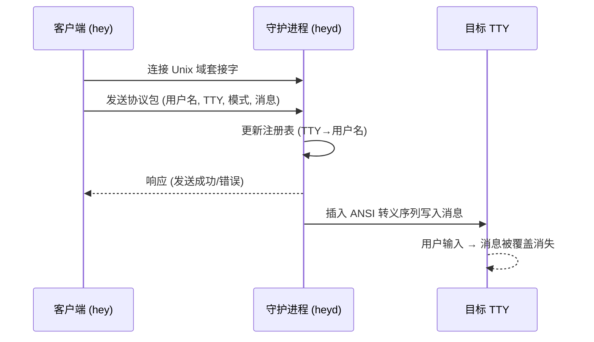

# Hey

**Hey** 是一个轻量级的命令行即时通信工具，基于 Zig 实现，采用客户端/守护进程架构，所有消息通过 Unix 域套接字传递。它的核心特点是 **阅后即焚**——当你在终端收到消息后，一旦敲下任意按键，消息即会被之后的输入内容覆盖消失。

## ✨ 特性

- **终端级即时通信**：所有交互都发生在命令行中，无需任何图形界面。
- **阅后即焚**：消息通过 ANSI 转义序列插入到目标终端的当前光标位置，一旦收信人开始输入，消息便被“焚烧”消失。
- **广播与私信**：支持向所有在线用户广播消息，也支持通过 `@username` 向指定用户私信。
- **自动发现与注册**：守护进程通过扫描 `/proc` 自动发现在线用户的 TTY，并维护用户注册表。
- **自适应换行**：消息会根据目标终端的宽度自动换行。
- **轻量级**：依赖 Zero…… 仅需 Zig 标准库即可编译。

## 🏗 构建

你需要安装 **Zig 0.11 或更高版本**。

```bash
# 克隆仓库
git clone https://github.com/Geekstrange/Hey.git
cd Hey/source

# 编译服务端（守护进程）
zig build-exe heyd.zig -O ReleaseSafe

# 编译客户端
zig build-exe hey.zig -O ReleaseSafe
```

生成的 `heyd` 和 `hey` 可直接运行。

## 🚀 快速开始

### 1. 启动守护进程

首先需要在一台机器上启动 `heyd`（通常以 root 身份运行，因为它需要向其他用户的 TTY 写入并监听 `/var/run/hey.sock`）：

```bash
sudo ./heyd
```

守护进程会在后台持续运行，等待客户端连接。

### 2. 发送消息

```bash
# 广播消息给所有在线用户
./hey Hello everyone!

# 私信给指定用户（用户名通过 HEY_NAME 环境变量设置）
./hey @bob 晚上一起吃饭吗？
```

### 3. 设置你的显示名称

```bash
export HEY_NAME="YourName"
```

若不设置 `HEY_NAME`，则默认使用 `USER` 环境变量。

## 🧠 工作流程



1. 客户端 `hey` 收集参数、消息内容以及当前终端的 TTY 路径。
2. 通过 `/var/run/hey.sock` 连接到守护进程 `heyd`，并发送一个由换行符分隔的协议包：`用户名\nTTY\n模式\n消息\n`。
3. 守护进程解析协议，将发送者的 TTY 与用户名注册到内部 HashMap 中。
4. 根据模式（`*` 广播 或 `@username` 私信）决定目标 TTY 列表。
5. 对每个目标 TTY，守护进程先获取终端宽度，对消息进行智能换行，然后通过 ANSI 转义序列（`\x1b7` 保存光标，`\x1b8` 恢复光标）将消息直接写入目标终端，**不干扰用户正在进行的输入**。
6. 收信人看到消息后，一旦敲击键盘，后续输入的字符会自然地覆盖掉消息文本，实现“阅后即焚”。

## 🔧 配置

| 环境变量 | 说明 | 默认值 |
|---------|------|--------|
| `HEY_NAME` | 你在聊天中的显示名称 | `$USER` 的值 |

## 📦 协议格式

客户端与服务端之间的通信协议十分简单，采用纯文本、换行符分隔的格式：

```
<用户名>\n
<TTY路径>\n
<模式>\n
<消息>\n
```

- **模式**：`*` 表示广播，`@username` 表示私信。
- **消息**：用户可以输入任意长度的文本。

## 📄 项目结构

```
.
├── source/
│   ├── hey.zig      # 客户端实现
│   └── heyd.zig     # 守护进程实现
├── LICENSE
└── README.md
```

## ⚖️ 许可证

本项目使用 MIT 许可证。详情请见 [LICENSE](LICENSE) 文件。

## 🤝 参与贡献

欢迎提交 Issue 和 Pull Request！请确保您的代码遵循现有的代码风格，并在提交前进行测试。